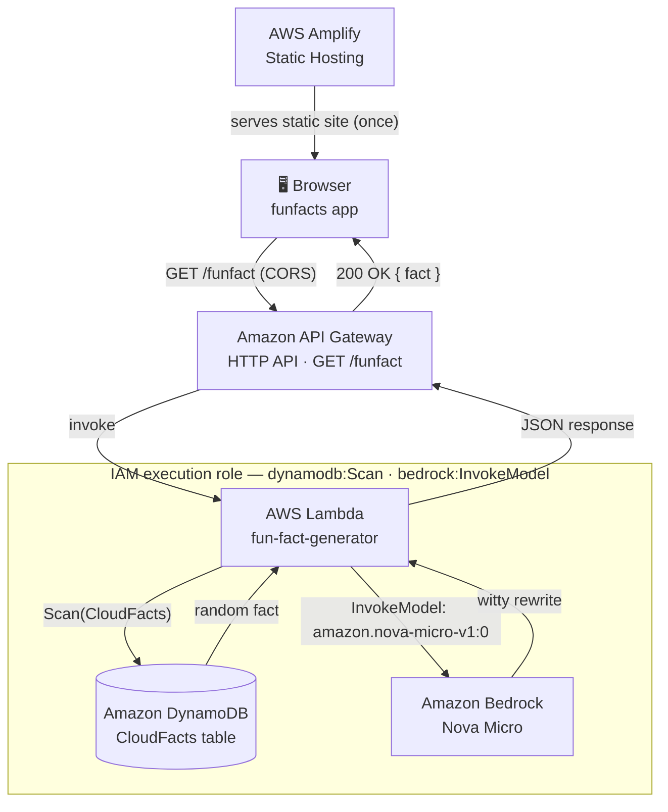

# Fun Fact Generator — Architecture



**How it works:** the browser loads the app once from Amplify, then on each request calls API Gateway, which invokes Lambda. Lambda scans DynamoDB for a random fact, sends it to Amazon Bedrock's Nova Micro model to be rewritten, and returns the result — all outbound calls from Lambda authorized by its IAM execution role.

This renders natively on GitHub — drop this file into your repo, or paste the ` ```mermaid ` block directly into your README.md.
