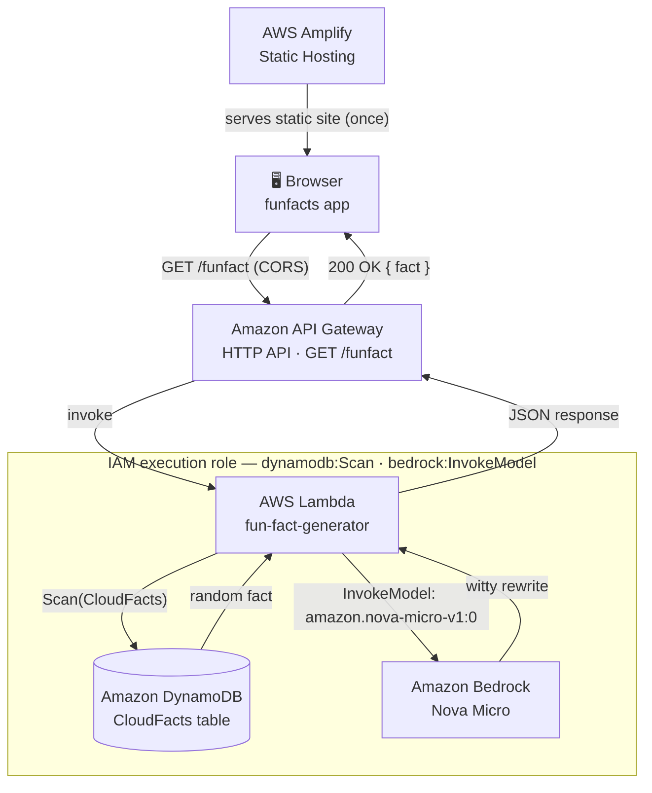

# Building a Serverless Fun Fact Generator on AWS (and Migrating It to Amazon Nova)

I wanted a small project that touched the core pieces of a modern serverless stack — compute, a database, an API layer, a real frontend, and generative AI — without turning into a multi-week build. What I ended up with is a "Fun Fact Generator": a service that pulls a random cloud-computing fact from a database and rewrites it in a witty, engaging voice using a foundation model on Amazon Bedrock, served through a simple web app.

It's a small project on the surface, but it touches almost every part of the AWS serverless toolkit, and building it surfaced a handful of real, instructive bugs — the kind you only really understand once you've hit them yourself.

## The architecture



A static frontend hosted on **AWS Amplify** calls **Amazon API Gateway**, which invokes an **AWS Lambda** function. That function scans an **Amazon DynamoDB** table (`CloudFacts`) for a random entry, sends it to **Amazon Bedrock** to be rewritten, and returns the result as JSON. Nothing here runs on a server I manage — it's Lambda, a managed API, a managed database, and a managed model endpoint, glued together with a bit of Python and IAM policy.

## Choosing Amazon Nova Micro

My first version called Claude 3.5 Sonnet on Bedrock to do the rewriting. It worked, but it was overkill: I was sending a short factual sentence and asking for a 1-2 sentence witty rewrite — a task with no need for a large, general-purpose reasoning model. I switched the integration to **Amazon Nova Micro**, Amazon's fastest and cheapest text-only model in the Nova family, invoked directly through `bedrock-runtime`'s `invoke_model` API rather than a Bedrock Agent.

The switch mostly meant adapting to Nova's request/response shape:

```python
body = {
    "schemaVersion": "messages-v1",
    "messages": [{"role": "user", "content": [{"text": prompt}]}],
    "inferenceConfig": {"maxTokens": 100, "temperature": 0.7, "topP": 0.9},
}
```

and reading the reply back out of `result["output"]["message"]["content"]` instead of Claude's `result["content"]`. At Nova Micro's pricing (roughly $0.035 per million input tokens and $0.14 per million output tokens), the model calls for this project cost a fraction of a cent — the model invocation is the cheapest part of the entire stack, well behind the free tiers on Lambda, DynamoDB, and Amplify.

## Three bugs worth remembering

**1. The missing `schemaVersion` field.** Nova's `invoke_model` request body requires a top-level `"schemaVersion": "messages-v1"` field that isn't obvious if you're used to Claude's request shape (which uses `anthropic_version` instead). Leaving it out produces a `ValidationException` — an easy one-line fix once you know to look for it.

**2. `AccessDeniedException` on `InvokeModel`.** After swapping the model, the Lambda started failing with an IAM permissions error. This is worth understanding precisely: Bedrock's old "Model access" console page has actually been **retired** — models like Nova are auto-enabled per-region now, with no manual approval step. The real gate is IAM: `bedrock:InvokeModel` is classified under the **Write** access level, not Read, so a role scoped only to read-type Bedrock actions (or scoped to the old Claude model's ARN) will fail. The fix was a policy statement granting `bedrock:InvokeModel` and `bedrock:InvokeModelWithResponseStream` against the Nova model's ARN — or, for a fast unblock during development, the AWS-managed `AmazonBedrockFullAccess` policy.

**3. A trailing slash in CORS.** Once the frontend moved to Amplify, the browser started blocking every request with "No 'Access-Control-Allow-Origin' header is present on the requested resource" — even after CORS looked correctly configured in API Gateway. The cause was a single trailing slash: `https://production.xxxx.amplifyapp.com/` was configured, but a browser's `Origin` header never includes one, so it never matched. CORS origin matching is an exact string comparison, not a prefix match — a detail that costs a confusing hour if you don't already know it.

## What it actually costs

Running the numbers: Nova Micro invocations run about $0.00001–0.00002 each, meaning even 10,000 calls in a month costs roughly a dime. Lambda, DynamoDB, and Amplify all sit comfortably inside their AWS free tiers for a project at this scale — 1,000 build minutes and 15GB of data transfer a month on Amplify, 1M free Lambda requests, and DynamoDB's free-tier read/write capacity. Realistically, the whole stack runs for **$0/month**, or a few cents during heavy testing.

## Why this project is worth building

It's a small app, but it's a genuine sample of how AWS's serverless services compose: an event-driven compute layer, a managed NoSQL store, a REST/HTTP API boundary with real cross-origin constraints, IAM as the actual permission model connecting services together (not just a formality), and a generative AI call sized appropriately to the task instead of reached for by default. For anyone building a portfolio project around AWS or cloud architecture, that combination — plus the debugging scars — says more than a polished demo with no rough edges ever could.
